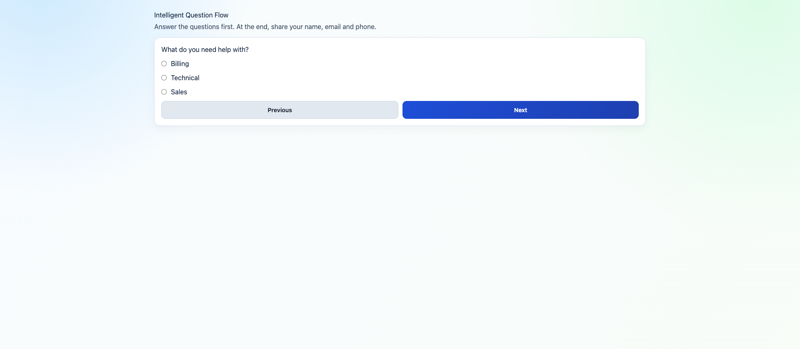
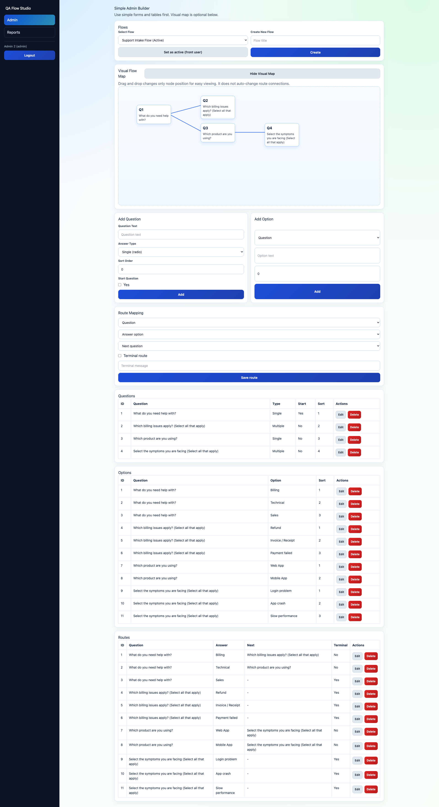
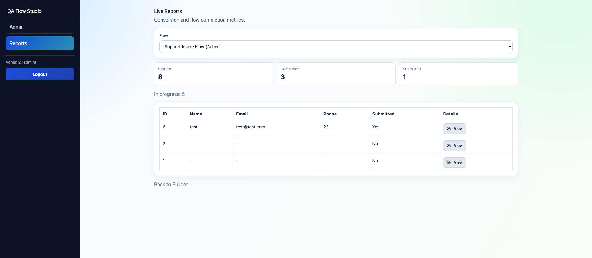

# QA Flow Studio

Build, launch, and optimize decision-tree style question flows with a visual admin builder and live reporting.

QA Flow Studio is a Laravel + React application for teams that need guided user journeys, branching logic, and lead capture in one lightweight product.

## Why QA Flow Studio

- Design multi-step flows without hardcoding every path
- Support both single-select and multi-select answers
- Route users to the next question or terminal result messages
- Capture leads only after flow completion
- Monitor sessions and answer trails from a live report view

## Product Areas

- User Flow Runner: `/`
- Admin Builder: `/admin`
- Admin Login: `/login`
- Reports Dashboard: `/report`

## Tech Stack

- Laravel 12
- React 19
- React Router 7
- Vite 7
- SQLite by default

## Quick Start

1. Clone and enter the project

```bash
git clone <your-repo-url>
cd question-answer-app
```

2. Install dependencies

```bash
composer install
npm install
```

3. Configure environment

```bash
cp .env.example .env
php artisan key:generate
```

4. Prepare database and migrate

```bash
touch database/database.sqlite
php artisan migrate
```

5. Create an admin user

```bash
php artisan qa:create-admin admin@example.com --name="Admin" --password="StrongPassword123!"
```

6. Run app

```bash
php artisan serve
npm run dev
```

Then open `http://127.0.0.1:8000`.

## Commands

- Run tests: `php artisan test`
- Production build: `npm run build`
- Create/promote admin: `php artisan qa:create-admin <email> --name="Name" --password="StrongPassword123!"`
- Reset demo flow data: `php artisan qa:reset-flow --force`

## API Surface

Public flow endpoints:

- `POST /api/flow/start`
- `POST /api/flow/answer`
- `POST /api/flow/lead`
- `POST /api/flow/prune`

Auth endpoints:

- `POST /auth/login`
- `POST /auth/logout`
- `GET /auth/me`
- `GET /auth/csrf-token`

Protected admin endpoints:

- `GET /admin-api/questionnaires`
- `POST /admin-api/questionnaires`
- `PUT /admin-api/questionnaires/{id}/activate`
- `GET /admin-api/flow`
- `GET /admin-api/sessions/{id}/answers`
- `POST /admin-api/questions`
- `PUT /admin-api/questions/{id}`
- `DELETE /admin-api/questions/{id}`
- `POST /admin-api/options`
- `PUT /admin-api/options/{id}`
- `DELETE /admin-api/options/{id}`
- `POST /admin-api/routes`
- `PUT /admin-api/routes/{id}`
- `DELETE /admin-api/routes/{id}`

## Public Repo Checklist

- No committed `.env` file or local secrets
- No committed local SQLite DB file
- Dependencies and build artifacts ignored (`node_modules`, `vendor`, `public/build`)
- Admin credentials are not prefilled or hardcoded in UI/docs

## Demo Preview

### 1) Public Flow Runner
Users answer guided questions and receive a terminal outcome, then submit lead details.



### 2) Admin Flow Builder
Create questionnaires, add questions/options, and map routes visually.



### 3) Live Reports Dashboard
Track sessions, completion status, and view question-answer trails per user.



## License

MIT
